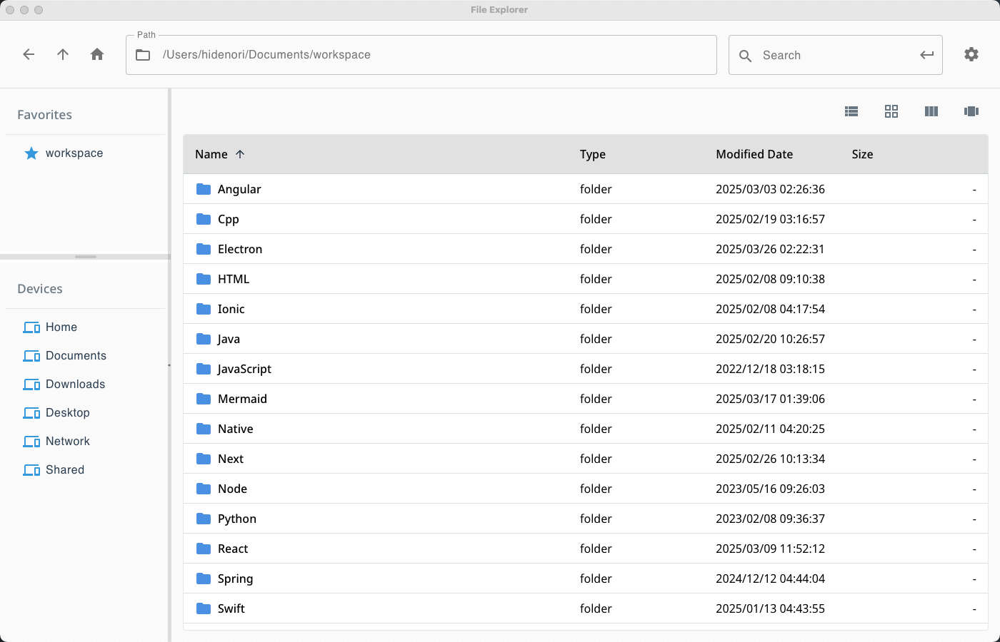
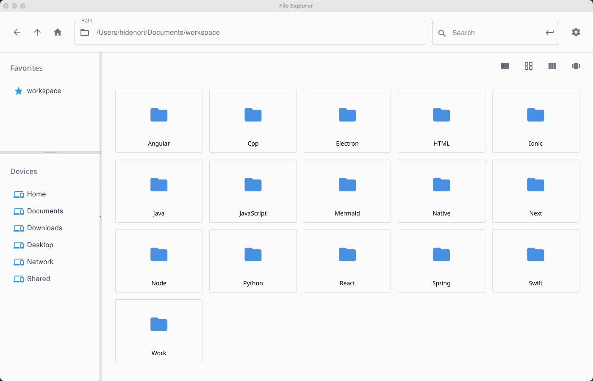
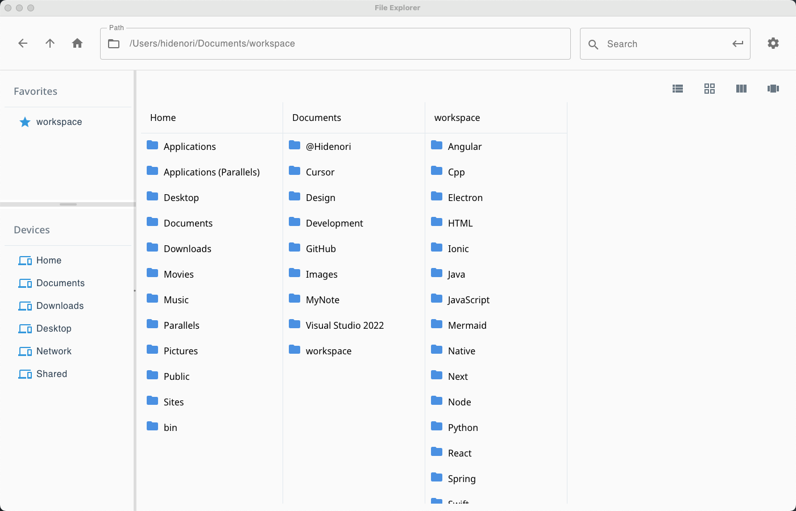
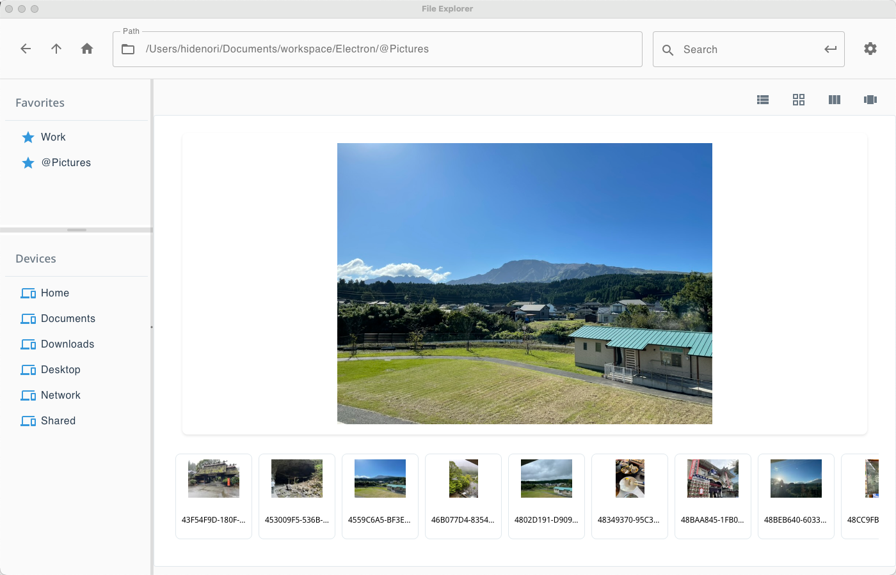
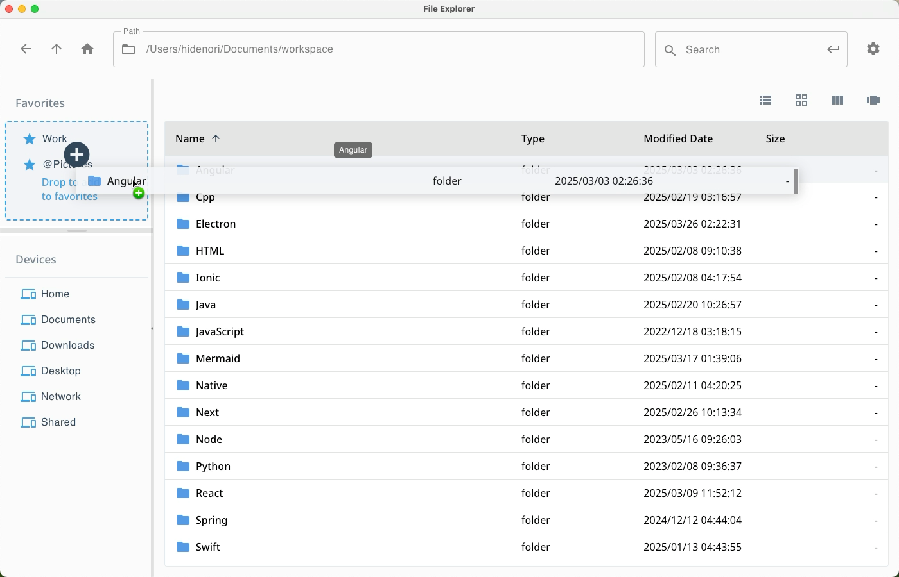
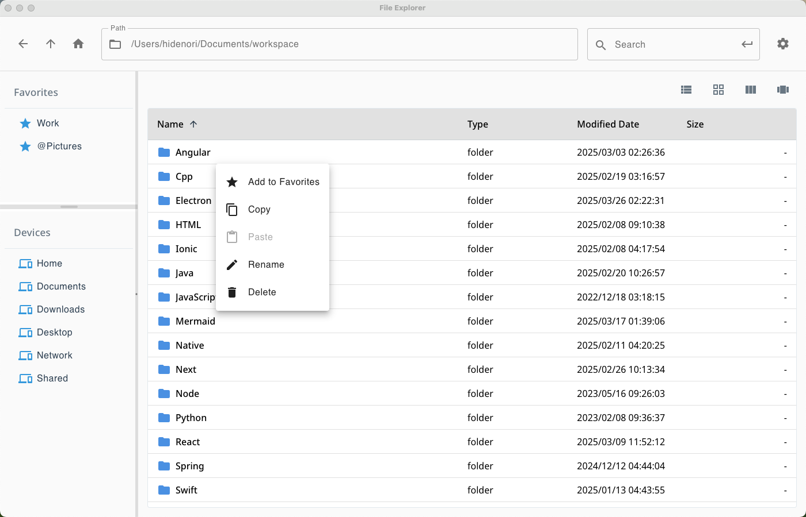

# File Explorer

A modern file explorer application built with Angular and Electron, providing a native desktop experience for browsing and managing files.

## Features

- Modern and responsive user interface
- File and directory browsing
- File size display
- Directory selection dialog
- Cross-platform support (Windows, macOS, Linux)
- Secure file system access through Electron's IPC
- File and directory navigation
- File search functionality
- File type icons
- File size formatting
- Multi-language support (English/Japanese)
- Settings drawer
- File opening with associated applications
- Tile view with lazy loading of images
- Context menu support
- Drag and drop operations
- Image thumbnail preview

## Prerequisites

- Node.js (v16 or later)
- npm (v7 or later)
- Angular CLI (v17 or later)

## Installation

1. Clone the repository:
```bash
git clone <repository-url>
cd file-explorer
```

2. Install dependencies:
```bash
npm install
```

## Development

To run the application in development mode:

```bash
npm run electron:serve
```

This will:
1. Start the Angular development server
2. Launch the Electron application
3. Open DevTools for debugging

## Building for Production

To create a production build:

```bash
npm run electron:build
```

This will:
1. Build the Angular application in production mode
2. Package the application with Electron
3. Generate distributable files in the `release` directory

### Build Output

The build process generates the following files:
- `release/mac-arm64/File Explorer.app` - macOS application bundle
- `release/File Explorer-0.0.0-arm64.dmg` - macOS DMG installer
- `release/File Explorer-0.0.0-arm64-mac.zip` - macOS ZIP archive

## Project Structure

```
file-explorer/
├── src/                    # Angular application source
│   ├── app/               # Application components and services
│   ├── assets/            # Static assets
│   └── styles.css         # Global styles
├── electron/              # Electron main process files
│   ├── main/             # Main process entry point
│   │   └── main.js       # Main process initialization
│   ├── services/         # Electron services
│   │   ├── fileExplorerService.js  # File system operations
│   │   ├── windowService.js        # Window management
│   │   ├── fileSearchService.js    # File search functionality
│   │   └── navigationService.js    # Navigation handling
│   ├── handler/          # IPC handlers
│   │   └── ipcHandlers.js # IPC communication handlers
│   ├── preload/          # Preload scripts
│   │   └── preload.js    # Preload script for IPC
│   └── constant/         # Constants and configurations
│       └── constants.js  # Application constants
├── dist/                  # Angular build output
└── release/              # Electron build output
```

## Security

The application implements several security measures:
- Context isolation enabled
- Node integration disabled
- Web security enabled
- Secure IPC communication between main and renderer processes

## License

This project is licensed under the MIT License - see the LICENSE file for details.

## Class Diagram

```mermaid
classDiagram
    class FileExplorerComponent {
        +items: FileItem[]
        +currentPath: string
        +loading: boolean
        +error: string | null
        +searchQuery: string
        +isSearching: boolean
        +viewingFile: FileItem | null
        +fileContent: string
        +isDrawerOpen: boolean
        +currentLang: string
        +themeVariant: string
        +devices: Device[]
        +isListView: boolean
        +viewMode: 'list' | 'tile' | 'column' | 'carousel'
        +favorites: ( name: string; path: string; )s[]
        -fileExplorerService: FileExplorerService
        -translate: TranslateService
        -fileThemeService: FileThemeService
        -favoriteFolderService: FavoriteFolderService
        +ngOnInit()
        +ngOnDestroy()
        +loadDirectory(path: string)
        +goBack()
        +goUp()
        +goHome()
        +onItemClick(item: FileItem)
        +onSearch()
    }

    class ViewListComponent {
        +loading: boolean
        +items: FileItem[]
        -fileExplorerService: FileExplorerService
        -viewActionService: ViewActionService
        +ngOnInit()
        +ngOnDestroy()
        +onItemClick(item: FileItem)
        +onContextMenu(event: MouseEvent, item: FileItem)
    }

    class ViewTileComponent {
        +items: FileItem[]
        -fileExplorerService: FileExplorerService
        -viewActionService: ViewActionService
        +ngOnInit()
        +ngOnDestroy()
        +onItemClick(item: FileItem)
        +onContextMenu(event: MouseEvent, item: FileItem)
    }

    class ViewColumnComponent {
        +items: FileItem[]
        -fileExplorerService: FileExplorerService
        -viewActionService: ViewActionService
        +ngOnInit()
        +ngOnDestroy()
        +onItemClick(item: FileItem)
        +onContextMenu(event: MouseEvent, item: FileItem)
    }

    class ViewCarouselComponent {
        +loading: boolean
        +items: FileItem[]
        -fileExplorerService: FileExplorerService
        -viewActionService: ViewActionService
        +ngOnInit()
        +ngOnDestroy()
        +onItemClick(item: FileItem)
        +onContextMenu(event: MouseEvent, item: FileItem)
    }

    class FileExplorerService {
        -electron: ElectronAPI
        +getFileIcon(filename: string)
        +isDirectory(path: string)
        +canGoUp(path: string)
        +isImageFile(filename: string)
        +getFileContent(path: string)
        +searchFiles(path: string, query: string)
    }

    class ViewActionService {
        +favoriteAdd: EventEmitter
        +itemCopy: EventEmitter
        +itemPaste: EventEmitter
        +itemRename: EventEmitter
        +itemDelete: EventEmitter
        +itemClick: EventEmitter
        -contextMenuService: ContextMenuService
        -dragOperationService: DragOperationService
        +onDragStart(event: DragEvent, item: FileItem)
        +onDragEnd(event: DragEvent)
        +onContextMenu(event: MouseEvent, item: FileItem)
    }

    class ContextMenuService {
        +favoriteAdd: EventEmitter
        +itemCopy: EventEmitter
        +itemPaste: EventEmitter
        +itemRename: EventEmitter
        +itemDelete: EventEmitter
        +showContextMenu(event: MouseEvent, item: FileItem)
    }

    class DragOperationService {
        +onDragStart(event: DragEvent, item: FileItem)
        +onDragEnd(event: DragEvent)
    }

    class FileItem {
        +name: string
        +path: string
        +isDirectory: boolean
        +size: number
        +modified: Date
    }

    FileExplorerComponent --> FileExplorerService
    FileExplorerComponent --> ViewActionService
    ViewListComponent --> FileExplorerService
    ViewListComponent --> ViewActionService
    ViewTileComponent --> FileExplorerService
    ViewTileComponent --> ViewActionService
    ViewColumnComponent --> FileExplorerService
    ViewColumnComponent --> ViewActionService
    ViewCarouselComponent --> FileExplorerService
    ViewCarouselComponent --> ViewActionService
    ViewActionService --> ContextMenuService
    ViewActionService --> DragOperationService
    FileExplorerService --> FileItem
    ViewActionService --> FileItem
```

The class diagram above illustrates the main components and services of the application, along with their relationships. The core components are:

- **FileExplorerComponent**: The main component that orchestrates the file explorer interface
- **View Components**: Different view types (List, Tile, Column, Carousel) for displaying files
- **Services**: Various services handling file operations, drag and drop, and context menu actions
- **FileItem**: The model class representing files and directories

The relationships show how components interact with services and how services depend on each other to provide the full functionality of the file explorer.

## Key Components

1. **FileExplorerComponent**
   - Main UI component handling user interactions
   - Manages file navigation and display
   - Handles language switching and settings

2. **FileExplorerService**
   - Core service for file system operations
   - Communicates with Electron backend
   - Handles file filtering and formatting

3. **FileItem**
   - Data model for file and directory items
   - Contains metadata like name, path, size, etc.

4. **ElectronAPI**
   - Interface for Electron backend communication
   - Handles native file system operations

5. **TranslationService**
   - Manages application translations
   - Supports multiple languages

## Dependencies

- Angular
- Electron
- Angular Material
- @ngx-translate/core
- @ngx-translate/http-loader

## Development

1. Install dependencies:
```bash
npm install
```

2. Run in development mode:
```bash
npm start
```

3. Build for production:
```bash
npm run build
```

## Electron and Angular Application Architecture

```mermaid
graph TB
    subgraph Angular["Angular Application (Renderer Process)"]
        FE[FileExplorerComponent]
        FES[FileExplorerService]
        FTS[FileThemeService]
        VAS[ViewActionService]
        CMS[ContextMenuService]
        DOS[DragOperationService]
        VTC[ViewTileComponent]
        VLC[ViewListComponent]
        VCC[ViewCarouselComponent]
        API[ElectronAPI Interface]
    end

    subgraph Electron["Electron (Main Process)"]
        Main[main.js]
        Preload[preload.js]
        IPC[ipcHandlers.js]
        FS[fileExplorerService.js]
        WS[windowService.js]
        NS[navigationService.js]
        SS[fileSearchService.js]
    end

    subgraph Native["Native System"]
        FileSystem[File System]
        Dialog[System Dialog]
        Shell[System Shell]
    end

    %% Angular Component Relationships
    FE --> FES
    FE --> FTS
    FE --> VAS
    VAS --> CMS
    VAS --> DOS
    VTC --> FES
    VTC --> VAS
    VLC --> FES
    VLC --> VAS
    VCC --> FES
    VCC --> VAS
    FES --> API

    %% Electron Bridge
    API --> Preload
    Preload --> IPC
    IPC --> Main

    %% Electron Service Relationships
    Main --> WS
    Main --> IPC
    IPC --> FS
    IPC --> NS
    IPC --> SS

    %% Native System Interactions
    FS --> FileSystem
    WS --> Dialog
    FS --> Shell

    classDef angular fill:#dd0031,stroke:#333,stroke-width:2px,color:white
    classDef electron fill:#47848f,stroke:#333,stroke-width:2px,color:white
    classDef native fill:#666,stroke:#333,stroke-width:2px,color:white

    class FE,FES,FTS,VAS,CMS,DOS,VTC,VLC,VCC,API angular
    class Main,Preload,IPC,FS,WS,NS,SS electron
    class FileSystem,Dialog,Shell native
```

The diagram above illustrates the architecture and communication flow between the Angular application and Electron:

1. **Angular Application (Renderer Process)**
   - `FileExplorerComponent`: Main UI component
   - `FileExplorerService`: Core service for file operations
   - `FileThemeService`: Theme management
   - `ViewActionService`: Service for handling view actions
   - `ContextMenuService`: Service for handling context menu actions
   - `DragOperationService`: Service for handling drag operations
   - `ViewTileComponent`: Component for displaying file tiles
   - `ViewListComponent`: Component for displaying file list
   - `ViewCarouselComponent`: Component for displaying file carousel
   - `ElectronAPI`: Interface for Electron communication

2. **Electron Bridge**
   - `preload.js`: Exposes safe IPC methods to renderer
   - `ipcHandlers.js`: Handles IPC communication
   - `main.js`: Main process initialization

3. **Electron Services**
   - `fileExplorerService.js`: File system operations
   - `windowService.js`: Window management
   - `navigationService.js`: Navigation handling
   - `fileSearchService.js`: File search functionality

4. **Native System**
   - File System: Direct file operations
   - System Dialog: Native dialogs
   - System Shell: External application launching

The communication flow:
1. Angular components call methods through the `ElectronAPI` interface
2. Calls are bridged through `preload.js` to the main process
3. `ipcHandlers.js` routes calls to appropriate services
4. Services interact with native system features
5. Results flow back through the same path to the Angular application

## Data Access Sequence

The application follows a well-defined data access sequence for the tile view:

1. Initialization:
   - Component initialization with event listeners
   - Scroll event setup for lazy loading
   - Service subscriptions for actions

2. User Interactions:
   - Item click handling with file type detection
   - Drag and drop operations
   - Context menu display
   - Scroll-based image loading

3. Image Loading:
   - Lazy loading of images based on viewport visibility
   - Image data retrieval through FileExplorerService
   - URL generation and caching
   - Error handling for failed image loads

4. Service Integration:
   - FileExplorerService for file operations
   - ViewActionService for user actions
   - ContextMenuService for menu management
   - DragOperationService for drag and drop

### Tile View Data Access Sequence Diagram

```mermaid
sequenceDiagram
    participant User
    participant ViewTileComponent
    participant FileExplorerService
    participant ContextMenuService
    participant ViewActionService
    participant TileItemComponent

    User->>ViewTileComponent: Page Load
    ViewTileComponent->>ViewTileComponent: ngOnInit()
    ViewTileComponent->>ViewActionService: Register Event Listeners
    ViewTileComponent->>ViewTileComponent: ngAfterViewInit()
    ViewTileComponent->>ViewTileComponent: Setup Scroll Event Listener

    User->>ViewTileComponent: Item Click
    ViewTileComponent->>FileExplorerService: Check isImageFile()
    alt Image File
        FileExplorerService->>ViewTileComponent: true
        ViewTileComponent->>FileExplorerService: openFileWithApp()
    else Other File
        FileExplorerService->>ViewTileComponent: false
        ViewTileComponent->>ViewActionService: Emit itemClick Event
    end

    User->>ViewTileComponent: Drag Start
    ViewTileComponent->>ViewActionService: onDragStart()
    ViewActionService->>DragOperationService: Start Drag Operation

    User->>ViewTileComponent: Context Menu
    ViewTileComponent->>ViewActionService: onContextMenu()
    ViewActionService->>ContextMenuService: Show Menu

    User->>ViewTileComponent: Scroll
    ViewTileComponent->>ViewTileComponent: onScroll()
    ViewTileComponent->>ViewTileComponent: loadVisibleImages()
    ViewTileComponent->>FileExplorerService: readImageFile()
    FileExplorerService->>ViewTileComponent: Return Image Data
    ViewTileComponent->>ViewTileComponent: Generate Image URL
```

### Tile View and Electron Layer Interaction Sequence

```mermaid
sequenceDiagram
    participant User
    participant ViewTileComponent
    participant FileExplorerService
    participant ElectronAPI
    participant Preload
    participant IPC
    participant Main
    participant FileSystem

    User->>ViewTileComponent: Page Load
    ViewTileComponent->>FileExplorerService: Initialize
    FileExplorerService->>ElectronAPI: readDirectory(currentPath)
    ElectronAPI->>Preload: IPC Request
    Preload->>IPC: Forward Request
    IPC->>Main: Handle IPC
    Main->>FileSystem: Read Directory
    FileSystem-->>Main: Directory Contents
    Main-->>IPC: Return Data
    IPC-->>Preload: Forward Response
    Preload-->>ElectronAPI: Return Data
    ElectronAPI-->>FileExplorerService: Return FileItems
    FileExplorerService-->>ViewTileComponent: Update Items

    User->>ViewTileComponent: Scroll to Image
    ViewTileComponent->>FileExplorerService: readImageFile(path)
    FileExplorerService->>ElectronAPI: readImageFile(path)
    ElectronAPI->>Preload: IPC Request
    Preload->>IPC: Forward Request
    IPC->>Main: Handle IPC
    Main->>FileSystem: Read Image File
    FileSystem-->>Main: Image Data
    Main-->>IPC: Return Data
    IPC-->>Preload: Forward Response
    Preload-->>ElectronAPI: Return Data
    ElectronAPI-->>FileExplorerService: Return Image Data
    FileExplorerService-->>ViewTileComponent: Update Image

    User->>ViewTileComponent: Drag Start
    ViewTileComponent->>FileExplorerService: onDragStart(item)
    FileExplorerService->>ElectronAPI: prepareDragData(item)
    ElectronAPI->>Preload: IPC Request
    Preload->>IPC: Forward Request
    IPC->>Main: Handle IPC
    Main-->>IPC: Return Drag Data
    IPC-->>Preload: Forward Response
    Preload-->>ElectronAPI: Return Data
    ElectronAPI-->>FileExplorerService: Return Drag Data
    FileExplorerService-->>ViewTileComponent: Start Drag Operation

    User->>ViewTileComponent: Context Menu
    ViewTileComponent->>FileExplorerService: getContextMenuData(item)
    FileExplorerService->>ElectronAPI: getContextMenuData(item)
    ElectronAPI->>Preload: IPC Request
    Preload->>IPC: Forward Request
    IPC->>Main: Handle IPC
    Main-->>IPC: Return Menu Data
    IPC-->>Preload: Forward Response
    Preload-->>ElectronAPI: Return Data
    ElectronAPI-->>FileExplorerService: Return Menu Data
    FileExplorerService-->>ViewTileComponent: Show Context Menu
```

This sequence diagram illustrates the main interactions between the tile view and Electron layer:

1. **Initialization and Directory Loading**
   - Load directory contents on page load
   - Access file system through Electron's IPC
   - Return results to component

2. **Image Loading**
   - Request image data on scroll
   - Load image file through Electron's IPC
   - Return image data to component

3. **Drag Operation**
   - Prepare data on drag start
   - Get drag data through Electron's IPC
   - Start drag operation

4. **Context Menu**
   - Request data when showing context menu
   - Get menu data through Electron's IPC
   - Display context menu

In each step, data follows this path:
1. Angular Component → Service
2. Service → ElectronAPI
3. ElectronAPI → Preload Script
4. Preload Script → IPC Handler
5. IPC Handler → Main Process
6. Main Process → File System
7. Results return through the reverse path

## Screenshots








